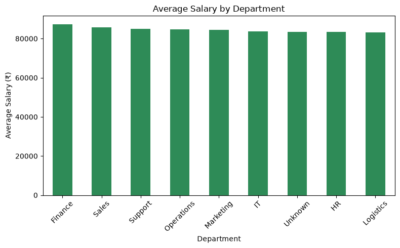
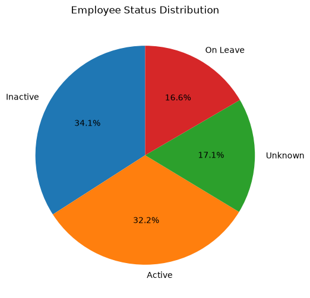

# 👥 Messy Employee Dataset — Data Cleaning & Exploratory Data Analysis

## 📌 Project Overview
This project takes a large, real-world-style **HR/employee dataset** (5,150 rows, 12 columns) containing common data quality issues and transforms it into a clean, analysis-ready dataset using **Python and pandas**. The cleaned data is then explored to uncover HR insights around department performance, salary distribution, employee status, and the relationship between education, pay, and performance.

## 🎯 Problem Statement
The raw dataset contained several real-world data quality issues, at a larger scale than typical beginner datasets:
- **149 duplicate rows**
- **Missing values across every column**, with Education missing over 1,300 entries
- **Inconsistent text formatting** — mixed casing (`sales` vs `MARKETING` vs `it`), extra whitespace in names and cities
- **Inconsistent/awkward category labels** after standard cleaning — e.g., `"It"` (should be `"IT"`), `"Phd"` (should be `"PhD"`)
- **Invalid values** — 36 rows contained **negative salaries**, a data-entry type error rather than a missing value
- **4 different date formats** mixed within the `JoiningDate` column

## 🛠️ Tools Used
- Python
- pandas
- matplotlib
- Jupyter Notebook (VS Code)

## 🧹 Data Cleaning Steps
1. **Removed 149 duplicate rows** using `drop_duplicates()` (5,150 → 5,001 rows)
2. **Handled missing values**:
   - Numeric columns (Age, Salary, YearsExperience, PerformanceScore) → filled with **median**
   - Categorical columns (Department, City, EmploymentStatus, Education) → filled with **'Unknown'**
   - Email → filled with **'Not Provided'** (an email is a unique identifier, not something to guess or default from another category)
3. **Standardized text columns** — stripped whitespace, applied Title Case, and manually corrected awkward auto-capitalization results (`"It"` → `"IT"`, `"Phd"` → `"PhD"`)
4. **Parsed mixed date formats** in `JoiningDate` using `pd.to_datetime(..., dayfirst=True, format='mixed', errors='coerce')`, then dropped rows with unparseable/missing dates
5. **Fixed invalid negative Salary values** using `.abs()`, treating them as sign-entry errors rather than missing data

**Result:** 5,150 rows → **4,819 clean, analysis-ready rows**, zero missing values, zero duplicates, zero invalid salary values.

## 📊 Exploratory Data Analysis — Key Insights
1. **IT (746) and Marketing (743)** have the largest headcounts among named departments.
2. **Finance pays the highest average salary** (₹87,258), though department-wise salary differences are relatively small — most departments cluster between ₹83,000–87,000.
3. Employee status is fairly evenly split: **Inactive (34.1%) is actually the largest group**, slightly ahead of Active (32.2%) — worth flagging for further investigation in a real business context.
4. **Higher education does not correlate with higher pay** in this dataset — Bachelors degree holders earn more on average (₹85,284) than PhD holders (₹81,366).
5. **Diploma and PhD holders show marginally higher average performance scores** than Bachelors or Masters holders, despite not being the highest earners — pay and performance don't move together here.

## 📈 Visualizations

## 📁 Files in this Repository
- `messy_employee_dataset_5000.csv` — original raw dataset
- `cleaned_employee_dataset.csv` — cleaned, analysis-ready dataset
- `employee_dataset_analysis.ipynb` — full notebook (cleaning + EDA + visualizations)
- `README.md` — this file

## 🚀 Key Takeaways
This project demonstrates data cleaning and EDA at a larger scale (5,000+ rows) than typical beginner practice, including handling invalid numeric values (not just missing ones), resolving awkward auto-formatted text labels, and identifying counter-intuitive business insights (education vs. pay vs. performance) through systematic exploratory analysis.

---
**Author:** Kaif Shaikh | [GitHub](https://github.com/kaifshaikh286)
